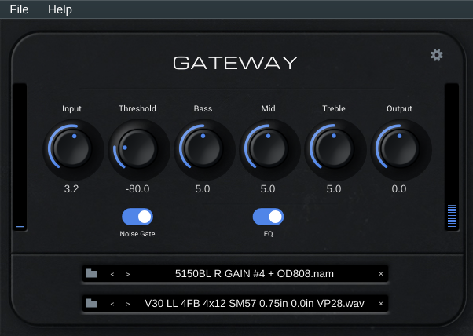

# NAMix

NAMix is a neural amp modeller plugin for Linux. It is based on
[NeuralAmpModelerPlugin](https://github.com/sdatkinson/NeuralAmpModelerPlugin)
by Steven Atkinson and all contributors to the Neural Amp Modeler project.
All original copyright is retained by Steven Atkinson.

iPlug2, the framework used by the original plugin, does not currently support
Linux. NAMix is a Linux port built using [JUCE](https://juce.com). Because
JUCE is used, this project is released under the GNU General Public Licence v3.
See [LICENCE](https://github.com/rations/namix-linux/blob/master/LICENCE) and
[NOTICE](https://github.com/rations/namix-linux/blob/master/NOTICE) for full
details.



NAMix ships as two separate binaries:

| Binary | Use |
|---|---|
| `NAMix.vst3` | VST3 plugin — load inside a DAW (REAPER, Ardour, Bitwig, Carla, …) |
| `NAMix` (standalone) | Standalone application — runs without a DAW, connects directly to your audio interface |

---

## System requirements

NAMix requires **glibc 2.35 or later**. This is present in:

| Distro | Version |
|---|---|
| Ubuntu | 22.04 LTS or newer |
| Debian | 12 (Bookworm) or newer |
| Devuan | 5 (Daedalus) or newer |
| Fedora | 36 or newer |
| Linux Mint | 21 or newer |
| Pop!_OS | 22.04 or newer |
| MX Linux | 23 or newer |
| Arch Linux | rolling |
| Manjaro | rolling |
| openSUSE Tumbleweed | rolling |
| Void | rolling |

Ubuntu 20.04, Debian 11 (Bullseye), RHEL/CentOS 9, and openSUSE Leap 15.x
ship glibc 2.31–2.34 and will not load these binaries. Users on those systems
should build from source (see below).

---

## Installing the pre-built release

Download `NAMix-0.3.0-linux-x86_64.tar.gz` from the
[Releases page](https://github.com/rations/namix-linux/releases).

Extract the archive:

```bash
tar -xzf NAMix-0.3.0-linux-x86_64.tar.gz
```

This creates a `NAMix-0.3.0/` directory containing both binaries. Install
whichever you need:

**VST3 plugin** — copy into your user VST3 folder:

```bash
mkdir -p ~/.vst3
cp -r NAMix-0.3.0/NAMix.vst3 ~/.vst3/
```

The plugin will appear as **NAMix** in any VST3-capable DAW. No other
dependencies need to be installed.

**Standalone application** — run directly from the extracted directory:

```bash
./NAMix-0.3.0/NAMix
```

On first launch, NAMix open audio settings
dialog where you select your ALSA or JACK device and sample rate. These
settings are saved and restored on subsequent launches. The standalone window
includes a **File → Preferences** menu to reopen the audio settings at any
time.

The standalone saves its last state (loaded model, IR, and all knob positions)
automatically when you close the window.

To uninstall:

```bash
rm -rf ~/.vst3/NAMix.vst3 ~/NAMix-0.3.0
```

---

## Building from source

```bash
git clone https://github.com/rations/namix-linux.git
cd namix-linux
git submodule update --init --recursive

cmake -B build -DCMAKE_BUILD_TYPE=Release
cmake --build build --parallel $(nproc)
```

Required system packages (Debian/Ubuntu):

```
build-essential cmake pkg-config libx11-dev libxext-dev libxcursor-dev
libgl-dev libfreetype-dev libfontconfig-dev libpng-dev zlib1g-dev
libcurl4-openssl-dev
```

After building, install the VST3:

```bash
mkdir -p ~/.vst3
cp -r build/NAMixLinux_artefacts/Release/VST3/NAMix.vst3 ~/.vst3/
```

Or run the standalone directly:

```bash
build/NAMixLinux_artefacts/Release/Standalone/NAMix
```

To build and package a release archive (produces
`NAMix-0.3.0-linux-x86_64.tar.gz` in the repo root):

```bash
bash scripts/makedist-linux.sh
```

---

## Usage

1. Load a `.nam` model file using the folder icon on the **NAM** row.
2. Optionally load an impulse response (`.wav`) on the **IR** row.
3. Adjust **Input**, **Output**, and tone-stack knobs (**Bass**, **Mid**,
   **Treble**) to taste.
4. The **EQ** toggle enables or disables the tone stack.
5. The **Noise Gate** toggle enables the noise gate; the **Threshold** knob
   sets the gate level.
6. The **⚙** (gear) button opens the settings panel where you can configure
   the input calibration level and output mode (Raw / Normalized / Calibrated).
7. If the loaded model supports slimming, a small icon appears to the right of
   the NAM row. Click it to open the Slim overlay and reduce the model size.

---

## Credits

- [Steven Atkinson](https://github.com/sdatkinson) — Neural Amp Modeler,
  NeuralAmpModelerCore, AudioDSPTools, original plugin design and assets
- All contributors to [NeuralAmpModelerPlugin](https://github.com/sdatkinson/NeuralAmpModelerPlugin)
- [JUCE](https://github.com/juce-framework/JUCE) — cross-platform audio
  application framework

---

## Licence

NAMix is free software released under the
[GNU General Public Licence v3](https://github.com/rations/namix-linux/blob/master/LICENCE).

The Neural Amp Modeler DSP core, original plugin code, and graphical assets
are copyright Steven Atkinson and used under the MIT Licence.
The fonts Michroma (OFL 1.1) and Roboto (Apache 2.0) are embedded under their
respective open licences.
See [NOTICE](https://github.com/rations/namix-linux/blob/master/NOTICE) for
full attribution and licence texts.
