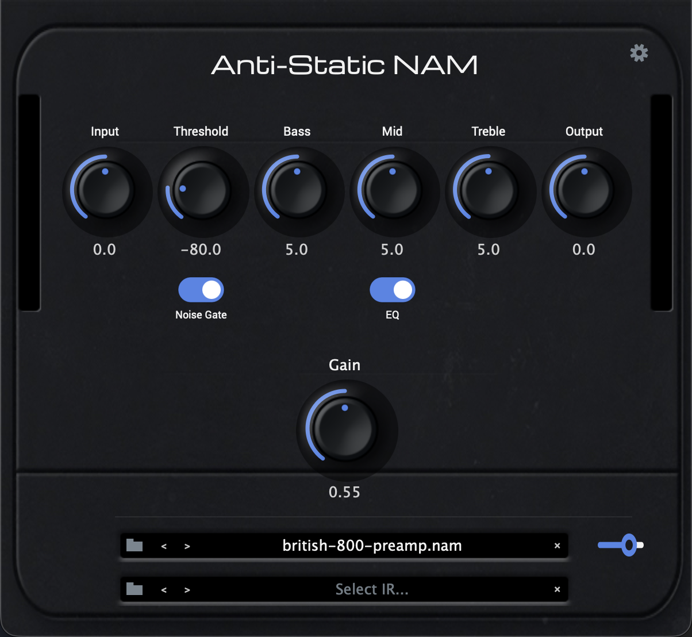

# NAMix

[](https://github.com/mrgeneko/NAMix/actions/workflows/build.yml)

NAMix is a cross-platform (Linux, macOS, Windows) neural amp modeller plugin. It is
based on [NeuralAmpModelerPlugin](https://github.com/sdatkinson/NeuralAmpModelerPlugin)
by Steven Atkinson and all contributors to the Neural Amp Modeler project.
All original copyright is retained by Steven Atkinson.

iPlug2, the framework the original plugin uses, doesn't support Linux -- NAMix
started as a Linux port built on [JUCE](https://juce.com) instead, and now covers
all three desktop platforms from that same JUCE codebase (one CMakeLists.txt, no
platform-specific plugin code -- see "Building from source" below). Because JUCE
is used, this project is released under the GNU General Public License v3. See
[LICENSE](https://github.com/mrgeneko/NAMix/blob/master/LICENSE) and
[NOTICE](https://github.com/mrgeneko/NAMix/blob/master/NOTICE) for full
details.

This fork builds against [Gene Ko's fork of
NeuralAmpModelerCore](https://github.com/mrgeneko/NeuralAmpModelerCore), which
adds support for **parametric (knob-controllable) models** — `.nam` files
whose FiLM conditioning responds to live knob values instead of being baked
in at training time — on top of Steven Atkinson's original DSP core. Loading
a parametric model surfaces its own knobs (with their real names and ranges)
inline, below the Noise Gate/EQ toggles; this only works with models
exported with parametric metadata, and is not available in the upstream
[sdatkinson/NeuralAmpModelerCore](https://github.com/sdatkinson/NeuralAmpModelerCore)-based
build.



NAMix ships these binaries (macOS gets all three; Linux and Windows get the first two):

| Binary | Use |
|---|---|
| `Anti-Static NAM.vst3` | VST3 plugin — load inside a DAW (REAPER, Ardour, Bitwig, Carla, …) |
| `Anti-Static NAM` (standalone) | Standalone application — runs without a DAW, connects directly to your audio interface |
| `Anti-Static NAM.component` (macOS only) | Audio Unit — needed for Logic Pro/GarageBand, which don't support VST3 at all |

---

## System requirements

**macOS**: Apple Silicon or Intel. Release builds are ad-hoc signed, not notarized --
see "Before you install" in each release's notes for the one-time Gatekeeper workaround.
No specific minimum OS version is pinned in the build yet (CI builds against whatever
SDK/deployment target the runner's Xcode defaults to); if you hit a "too old" load error
on an older macOS, please open an issue.

**Windows**: 64-bit (x86_64) Windows 10 or 11. Release builds are not code-signed --
the standalone `.exe` raises a SmartScreen warning on first run (choose **More info**,
then **Run anyway**).

**Linux**: requires **glibc 2.35 or later**. This is present in:

| Distro | Version |
|---|---|
| Ubuntu | 22.04 LTS or newer |
| Debian | 12 (Bookworm) or newer |
| Devuan | 5 (Daedalus) or newer |
| Fedora | 36 or newer |
| Linux Mint | 21 or newer |
| Pop!_OS | 22.04 or newer |
| MX Linux | 23 or newer |
| Arch Linux | rolling |
| Manjaro | rolling |
| openSUSE Tumbleweed | rolling |
| Void | rolling |

Ubuntu 20.04, Debian 11 (Bullseye), RHEL/CentOS 9, and openSUSE Leap 15.x
ship glibc 2.31–2.34 and will not load these binaries. Users on those systems
should build from source (see below).

---

## Installing the pre-built release

All platforms: download the archive for your OS from the
[Releases page](https://github.com/mrgeneko/NAMix/releases). The standalone app
saves its last state (loaded model, IR, and all knob positions) automatically when
you close the window, and shows an audio-settings dialog on first launch (**File →
Preferences** reopens it later).

### Linux

```bash
tar -xzf NAMix-0.5.0-linux-x86_64.tar.gz
```

This creates a `NAMix-0.5.0/` directory containing both binaries. Install
whichever you need:

**VST3 plugin** — copy into your user VST3 folder:

```bash
mkdir -p ~/.vst3
cp -r "NAMix-0.5.0/Anti-Static NAM.vst3" ~/.vst3/
```

The plugin will appear as **Anti-Static NAM** in any VST3-capable DAW. No other
dependencies need to be installed.

**Standalone application** — run directly from the extracted directory:

```bash
"./NAMix-0.5.0/Anti-Static NAM"
```

The audio-settings dialog lets you pick your ALSA or JACK device and sample rate.

To uninstall:

```bash
rm -rf ~/.vst3/"Anti-Static NAM.vst3" ~/NAMix-0.5.0
```

### macOS

```bash
unzip NAMix-0.5.0-macos-arm64.zip   # or -x86_64 on Intel Macs
```

This creates a `NAMix-0.5.0/` directory containing the VST3, the Audio Unit, and
the standalone app. Install whichever you need:

```bash
mkdir -p ~/Library/Audio/Plug-Ins/VST3 ~/Library/Audio/Plug-Ins/Components
cp -r "NAMix-0.5.0/Anti-Static NAM.vst3" ~/Library/Audio/Plug-Ins/VST3/
cp -r "NAMix-0.5.0/Anti-Static NAM.component" ~/Library/Audio/Plug-Ins/Components/
```

The Audio Unit is required for Logic Pro/GarageBand, which don't support VST3 at
all; other DAWs (Ableton Live, Reaper, Bitwig, …) can use either. Rescan plug-ins
in your DAW afterward.

Since these builds are ad-hoc signed rather than notarized, the first launch of
either the standalone app or a DAW scanning the plugin will trigger a Gatekeeper
warning ("cannot be opened because the developer cannot be verified"). Right-click
(Control-click) it, choose **Open**, and confirm — needed only once per binary.

**Standalone application**:

```bash
open "NAMix-0.5.0/Anti-Static NAM.app"
```

### Windows

Unzip `NAMix-0.5.0-windows-x86_64.zip`. This creates a `NAMix-0.5.0\` directory
containing the VST3 and the standalone app.

**VST3 plugin** — copy the whole `.vst3` folder into your VST3 directory:

```
copy /E "NAMix-0.5.0\Anti-Static NAM.vst3" "%COMMONPROGRAMFILES%\VST3\Anti-Static NAM.vst3"
```

(or `%LOCALAPPDATA%\Programs\Common\VST3` if you'd rather not need admin rights),
then rescan plug-ins in your DAW.

**Standalone application** — run `Anti-Static NAM.exe` directly; it isn't
code-signed, so the first launch raises a SmartScreen warning (**More info** →
**Run anyway**).

---

## Building from source

One `CMakeLists.txt`, one plugin source tree, no platform-specific plugin code --
Linux/macOS/Windows differ only in a handful of build-system details (documented
inline in `CMakeLists.txt`: WHOLE_ARCHIVE linking syntax, AU only existing on
macOS, MSVC's differently-named fast-math flag). Build artifacts land under
`build/NAMix_artefacts/Release/<VST3|AU|Standalone>/`.

```bash
git clone https://github.com/mrgeneko/NAMix.git
cd NAMix
git submodule update --init --recursive
```

### Linux

```bash
cmake -B build -DCMAKE_BUILD_TYPE=Release
cmake --build build --parallel $(nproc)
```

Required system packages (Debian/Ubuntu):

```
build-essential cmake pkg-config libx11-dev libxext-dev libxcursor-dev
libxrandr-dev libxinerama-dev libgl-dev libfreetype-dev libfontconfig-dev
libpng-dev zlib1g-dev libcurl4-openssl-dev libasound2-dev
libwebkit2gtk-4.1-dev
```

After building, install the VST3:

```bash
mkdir -p ~/.vst3
cp -r "build/NAMix_artefacts/Release/VST3/Anti-Static NAM.vst3" ~/.vst3/
```

Or run the standalone directly:

```bash
"build/NAMix_artefacts/Release/Standalone/Anti-Static NAM"
```

To build and package a release archive (produces
`dist/NAMix-<version>-linux-<arch>.tar.gz`):

```bash
bash scripts/makedist-linux.sh
```

### macOS

Requires Xcode (for the toolchain/SDKs) and CMake 3.24+.

```bash
cmake -B build -DCMAKE_BUILD_TYPE=Release
cmake --build build --parallel "$(sysctl -n hw.ncpu)"
```

Builds `NAMix_artefacts/Release/{VST3,AU,Standalone}/` -- the Audio Unit is only
built here, on macOS. Package a release archive with:

```bash
bash scripts/makedist-macos.sh   # dist/NAMix-<version>-macos-<arch>.zip
```

### Windows

Requires Visual Studio (the C++ desktop workload) and CMake 3.24+.

```powershell
cmake -B build -A x64
cmake --build build --config Release --parallel
```

Visual Studio is a multi-config generator -- `--config Release` (not
`CMAKE_BUILD_TYPE`) selects the build configuration, and `ctest` needs a matching
`-C Release`. Package a release archive with:

```powershell
.\scripts\makedist-windows.ps1   # dist\NAMix-<version>-windows-x86_64.zip
```

---

## Usage

1. Load a `.nam` model file using the folder icon on the **NAM** row.
2. Optionally load an impulse response (`.wav`) on the **IR** row.
3. Adjust **Input**, **Output**, and tone-stack knobs (**Bass**, **Mid**,
   **Treble**) to taste.
4. The **EQ** toggle enables or disables the tone stack.
5. The **Noise Gate** toggle enables the noise gate; the **Threshold** knob
   sets the gate level.
6. The **⚙** (gear) button opens the settings panel where you can configure
   the input calibration level and output mode (Raw / Normalized / Calibrated).
7. If the loaded model supports slimming, a small icon appears to the right of
   the NAM row. Click it to open the Slim overlay and reduce the model size.
8. If the loaded model is parametric, its own knobs appear inline below the
   Noise Gate/EQ toggles — names and ranges come from the model file
   itself, so they vary per model.

---

## Credits

- [Steven Atkinson](https://github.com/sdatkinson) — Neural Amp Modeler,
  NeuralAmpModelerCore, AudioDSPTools, original plugin design and assets
- All contributors to [NeuralAmpModelerPlugin](https://github.com/sdatkinson/NeuralAmpModelerPlugin)
- [Gene Ko](https://github.com/mrgeneko) — parametric (knob-controllable)
  model support in [this NeuralAmpModelerCore
  fork](https://github.com/mrgeneko/NeuralAmpModelerCore)
- [JUCE](https://github.com/juce-framework/JUCE) — cross-platform audio
  application framework

---

## License

NAMix is free software released under the
[GNU General Public License v3](https://github.com/mrgeneko/NAMix/blob/master/LICENSE).

The Neural Amp Modeler DSP core, original plugin code, and graphical assets
are copyright Steven Atkinson and used under the MIT License. The DSP core's
parametric model additions are copyright Gene Ko (fork modifications), also
under the MIT License.
The fonts Michroma (OFL 1.1) and Roboto (Apache 2.0) are embedded under their
respective open licenses.
See [NOTICE](https://github.com/mrgeneko/NAMix/blob/master/NOTICE) for
full attribution and license texts.
